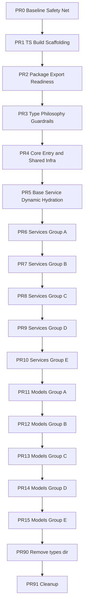

# EasyPost Node JS->TS Migration Plan

## Purpose

Migrate the codebase from JavaScript source + separate declaration files to TypeScript source while:

- Preserving runtime behavior and public API compatibility.
- Preserving permissive typing philosophy for SDK consumers.
- Removing the standalone `types/` source-of-truth by the end of migration.
- Delivering work as small, reviewable native GitHub stacked pull requests.

Execution details for branch naming, stack workflow, and PR ordering are documented in `TS_MIGRATION_EXECUTION_BOARD.md`.

## Current State Summary

- Runtime source is JavaScript under `src/`.
- Types are maintained separately under `types/` and published via package exports.
- Build is Vite-based and emits both CJS and ESM artifacts.
- CI includes build, node compatibility, tests, lint, coverage, and a TypeScript check for declaration files.

Implication: the repo currently has dual maintenance burden (runtime JS + parallel type declarations).

## GitHub Stacks Adoption Model

This migration uses GitHub native stacked pull requests (public preview) and the `gh stack` CLI extension.

- Bottom PR targets trunk (`master`).
- Every higher PR targets the branch directly below it.
- No integration branch is used.
- The stack is managed as one dependency chain.
- Rebase/sync is handled with stack-aware workflows (`gh stack sync` / `gh stack rebase`).

Merge behavior alignment:

- If the goal is to land the entire migration stack in one action, merge from the top PR (or use stack merge up to top).
- Pull requests still merge bottom-up logically as part of the stack operation.
- If only a lower PR is merged, higher PRs stay open and are automatically re-targeted/rebased by stack mechanics.

## Migration Principles

### Backwards Compatibility

- Keep package name, import paths, exports, and runtime object/service behavior unchanged.
- Keep CJS + ESM outputs and file names (`dist/easypost.js` and `dist/easypost.mjs`).
- Avoid introducing runtime validation that rejects currently accepted input unless explicitly approved as breaking.
- Preserve support matrix for Node versions currently validated in CI.
- Keep public method names, parameter ordering, and return semantics stable.
- Keep all test assertions and code the same, they serve as the source of truth the migration worked properly.

### Permissive Type Philosophy

- Maintain broad input and extension points where API payloads are variable.
- Prefer `unknown` over `any` by default at boundaries, but allow targeted `any` escape hatches where required for compatibility/extensibility.
- Use optional fields and index signatures for dynamic API object shapes.
- Strongly type stable contracts (service names, IDs, known envelopes) while leaving long-tail API fields permissive.
- Minimize consumer breakage from stricter typing; widen instead of narrowing when in doubt.

### Delivery and Risk

- Use one stacked PR chain with small, independent review scope per layer.
- Keep each PR behavior-preserving and green in CI.
- Defer broad refactors until after full TS compilation parity is established.
- Avoid side branches that bypass stack ordering.
- Open stack PRs as drafts by default and mark ready only after layer checks pass.
- Replace PR template boilerplate with concise PR-specific summaries for each layer.

## Target End State

- `src/` fully migrated to `.ts` (and `.mts`/`.cts` only if needed).
- Type declarations generated from TypeScript source during build (`dist/*.d.ts` and maps as needed).
- `types/` directory removed from source control.
- `package.json` `types`/`exports.types` point to generated declaration output in `dist`.
- CI validates TS source compilation and type generation directly from runtime source.

## Non-Goals

- No intentional API redesign.
- No large behavioral refactors bundled with migration.
- No strict domain modeling of every API field if that harms permissiveness or compatibility.

## High-Level Workstreams

1. Tooling + build pipeline modernization for TS source support.
2. Type strategy + compatibility policy implementation.
3. Incremental source conversion (`src/` modules).
4. Test and CI adaptation.
5. Packaging/export transition from `types/` to generated declarations.
6. Cleanup and stabilization.

## Stacked PR Plan (Small Chunks)

The following plan is implemented as one ordered GitHub stack. Each PR is a layer in the same chain.

Operational note: use `gh stack submit --auto` during creation/updates so new stack PRs open as drafts by default.

### PR 0 - Baseline Safety Net and Telemetry

Scope:

- Add migration tracking doc/checklist references.
- Capture baseline behavior snapshots:
  - test pass status
  - node compatibility pass status
  - package surface snapshot (`exports`, `main`, `module`, `types`)
- Add lightweight API-surface verification script (public entry shape smoke check).

Acceptance criteria:

- Existing CI remains green.
- Baseline artifacts/scripts available and documented.

### PR 1 - TS Build Scaffolding (No Source Conversion Yet)

Scope:

- Introduce migration `tsconfig` layout for source compilation:
  - `tsconfig.base.json`
  - `tsconfig.build.json`
  - `tsconfig.test.json` (if needed)
- Configure compiler options for permissive migration:
  - `allowJs: true` (initially)
  - `checkJs: false` (initially)
  - `declaration: true`
  - `emitDeclarationOnly: false` (or split with declaration emit config)
  - conservative strictness profile with targeted opt-outs where needed
- Update lint/parser setup to handle mixed JS/TS source during transition.
- Keep current outputs intact.

Acceptance criteria:

- Build succeeds with mixed JS/TS inputs.
- No runtime output changes.
- CI still green.

### PR 2 - Package/Export Readiness for Generated Types

Scope:

- Prepare package metadata for eventual generated declarations in `dist`.
- Keep current `types/` wiring active until cutover PR.
- Add compatibility tests for CJS and ESM import paths.

Acceptance criteria:

- No consumer-visible export change yet.
- Compatibility tests pass.

### PR 3 - Type Philosophy and Guardrails

Scope:

- Add `TYPE_STRATEGY.md` (or section in this plan) codifying permissive TS rules:
  - when to use `unknown` vs `any`
  - allowable index signatures
  - widening rules for public API params
  - how to represent dynamic API payloads
- Add type tests for representative consumer usage:
  - permissive request payloads
  - hook middleware flexibility
  - common JS-like TS usage patterns

Acceptance criteria:

- Type tests pass.
- Rules documented and enforced in review checklist.

### PR 4 - Convert Core Entry and Shared Infrastructure

Scope:

- Convert entrypoint and shared core files first:
  - `src/easypost.js`
  - `src/constants.js`
  - shared utility modules
  - core error handler plumbing
- Preserve dynamic behavior in conversion (no logic rewrite).
- Add minimal internal types/interfaces for request/response hooks.

Acceptance criteria:

- Runtime tests unchanged and passing.
- Generated declarations for converted modules are correct.
- No public API breaks.

### PR 5 - Convert Base Service + Dynamic Hydration Layer

Scope:

- Convert `src/services/base_service.js` and closely related model base files.
- Model dynamic object hydration using permissive patterns:
  - discriminated known keys where stable
  - fallback index signatures for unknown object members
- Keep ID-prefix and object-name mapping behavior identical.

Acceptance criteria:

- Existing service tests pass unchanged.
- Type signatures remain permissive for dynamic payloads.

### PR 6-10 - Service Group Conversion Layers

Scope:

- Split service conversion into five sequential stack layers:
  - PR6 Group A: Address, Parcel, Customs, Shipment
  - PR7 Group B: Batch, Order, Pickup, Rate, SmartRate, ScanForm, Refund
  - PR8 Group C: CarrierAccount, CarrierType, CarrierMetadata, Billing
  - PR9 Group D: Tracker, Event, Webhook, Insurance, Claim
  - PR10 Group E: User, ApiKey, Referral/CustomerPortal, EndShipper, Embeddable, Luma, FedExRegistration
- Convert service files and immediate model dependencies only.
- Keep method signatures and behavior stable.

Acceptance criteria per layer:

- Layer-level tests pass.
- No regressions in API behavior.
- Declaration output generated from TS for converted modules.

### PR 11-15 - Model Group Conversion Layers

Scope:

- Convert remaining model classes in five sequential layers aligned to Groups A-E.
- Preserve open object shapes and helper methods.
- Keep serialization/deserialization semantics unchanged.

Acceptance criteria per layer:

- Model tests and service integration tests pass.
- No runtime shape regressions.

### PR 90 - Remove Standalone `types/` Source

Scope:

- Replace `types/` declaration source with generated declarations from `src/`.
- Remove `types/` from repo.
- Update package metadata:
  - `types` path -> `dist/...d.ts`
  - `exports["."].types` -> generated path
- Update CI to compile/check generated declarations from source.

Acceptance criteria:

- Consumer TS demo/tests pass against generated declarations.
- `types/` directory no longer required.
- Package pack/install smoke tests pass.

### PR 91 - Strictness Calibration + Cleanup

Scope:

- Remove migration-only tsconfig/lint exceptions no longer needed.
- Keep intentional permissive points documented.
- Clean dead code, stale comments, and temporary migration scripts.

Acceptance criteria:

- CI fully green.
- Migration checklist complete.

## Suggested Stack Graph

## Detailed Change Inventory

### 1) Source File Extension Changes

- Rename `src/**/*.js` -> `src/**/*.ts` in batches.
- Update all relative imports to extensionless or TS-compatible resolution strategy consistent with build.
- Ensure generated `dist` file names remain unchanged.

### 2) Build and Compiler

- Introduce source-compilation tsconfig for `src/`.
- Generate declarations from source into `dist` (or intermediate + copy to dist).
- Keep Vite bundling behavior for CJS/ESM output parity.
- Add/adjust source map configuration parity.

### 3) Lint and Formatting

- Ensure ESLint parser/plugin config supports mixed mode then TS-only mode.
- Add rules to avoid accidental over-tightening of public API types.

### 4) Package Metadata

- Update `types` and `exports.types` paths to generated declarations.
- Ensure `files`/publish inclusion includes declaration outputs and excludes old `types/` source.

### 5) CI Workflows

- Replace declaration-only check with TS source compile + type generation checks.
- Keep node compatibility matrix unchanged.
- Add package smoke test for CJS/ESM/TS consumer install.

### 6) Tests

- Keep runtime unit/integration tests unchanged where possible.
- Add type-level consumer tests:
  - permissive object payload acceptance
  - middleware hook typing flexibility
  - common endpoint return value usage

### 7) Documentation

- Update README and upgrade guide sections to reflect:
  - types are generated from TS source
  - permissive type guarantees
  - any known typing caveats
- Add migration note for contributors (how to author permissive TS in this repo).

### 8) Repo Cleanup

- Remove `types/` directory after cutover.
- Remove obsolete scripts/config specific to old declaration maintenance.
- Verify docs generation still works with `.ts` inputs or update docs tooling config.

## Compatibility Contract Checklist (Must Pass Before Final Cutover)

- Public exports unchanged (`import`/`require` behavior).
- Public class/service names unchanged.
- Public method signatures behavior-compatible.
- Runtime response object behavior unchanged (including dynamic fields).
- Node compatibility matrix green.
- Existing tests green.
- TS consumer demo compiles using generated declarations.
- No mandatory code changes for existing JS consumers.

## Permissive Typing Rules (Concrete)

Use these defaults unless there is strong evidence a narrower type is needed:

- Request payload inputs:
  - `Record<string, unknown>` for open payloads.
  - Optional known fields plus index signature for endpoint-specific extras.
- API response objects:
  - Known top-level fields typed.
  - Additional dynamic properties via `[key: string]: unknown`.
- Middleware/hooks:
  - Flexible request/response object interfaces with extensible fields.
- IDs and enums:
  - Keep stable ID prefixes and known literal unions where non-breaking.
  - Prefer `string` over narrow unions when providers may introduce new values.
- Escape hatches:
  - Allow local `any` with comments for compatibility-critical dynamic points.

## Multi-Agent Execution Plan

Multiple agents can still help, but stack landing is serialized by design.

Recommended model:

1. One stack maintainer agent/person owns branch creation, `gh stack submit`, and `gh stack sync`.
2. Contributor agents prepare patches for upcoming layers against the current top branch tip.
3. Maintainer applies accepted patches in order, one stack layer per PR.
4. Reviewers approve each layer independently in GitHub stack UI.

Coordination rules:

- Each PR must include:
  - scope statement
  - compatibility checklist results
  - test evidence
  - risk notes
- No integration branch.
- No out-of-order branch creation.

## PR Template Additions (Recommended)

For each stacked PR, require:

- What changed (module list)
- Why safe (compatibility notes)
- Type permissiveness notes (what remained intentionally broad)
- Test evidence (runtime + type)
- Follow-up tasks left for next stack layer

## Rollback Strategy

- Because PRs are small and stacked, rollback by reverting from the highest merged layer downward as needed.
- Keep behavior snapshots from PR0 for quick diff-based validation.
- If type breakage appears in consumers, widen types in the nearest layer without runtime changes.

## Definition of Done

Migration is complete when:

- All runtime source under `src/` is TypeScript.
- Declarations are generated from source and published from `dist`.
- `types/` directory is removed.
- Compatibility checklist is fully green.
- Documentation and contributor guidance are updated.
- Stack is fully merged with no unresolved compatibility regressions.

## Post-Migration Cleanup (Expected)

Once the migration is complete and stable, evaluate and remove transitional scaffolding that is no longer needed.

Likely cleanup candidates:

- Consolidate TypeScript scripts in `package.json` if split commands are no longer necessary.
- Consolidate `tsconfig` files if build/test/type-checking can be expressed with fewer configs.
- Remove temporary migration-only lint exceptions once TypeScript source is the default.
- Re-evaluate migration-only compatibility tests and keep only long-term contract tests.
- Remove migration planning boilerplate from active contributor workflows after rollout.

Keep long-term:

- Runtime CJS/ESM compatibility tests.
- Type compatibility tests that protect permissive public SDK behavior.
- Any config explicitly required for dual-module packaging stability.

## Execution Checklist

- [ ] PR0 baseline and API surface snapshot
- [ ] PR1 TS scaffolding for mixed-mode build
- [ ] PR2 package/export readiness
- [ ] PR3 permissive typing policy and type tests
- [ ] PR4 core entry + shared infra conversion
- [ ] PR5 base service + hydration conversion
- [ ] PR6 services group A conversion
- [ ] PR7 services group B conversion
- [ ] PR8 services group C conversion
- [ ] PR9 services group D conversion
- [ ] PR10 services group E conversion
- [ ] PR11 models group A conversion
- [ ] PR12 models group B conversion
- [ ] PR13 models group C conversion
- [ ] PR14 models group D conversion
- [ ] PR15 models group E conversion
- [ ] PR90 remove `types/`, switch to generated declarations
- [ ] PR91 cleanup and strictness calibration
- [ ] README/UPGRADE docs updated
- [ ] final package smoke tests for CJS/ESM/TS consumers
